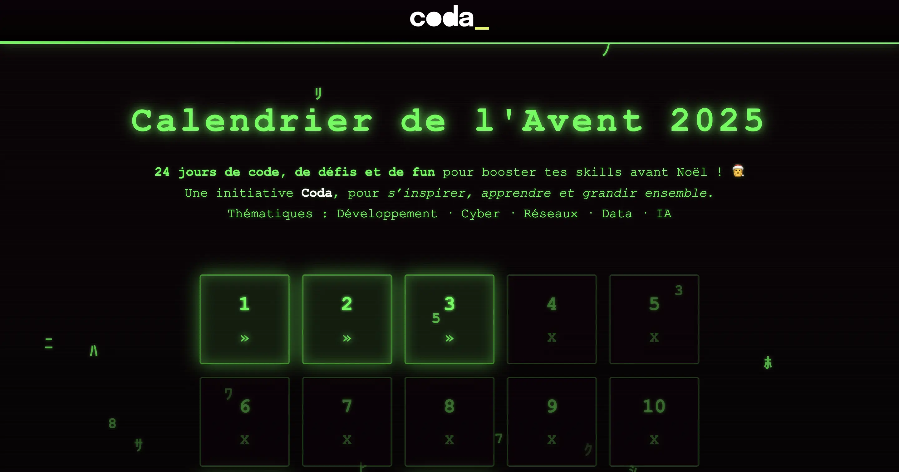

# Calendrier de l'Avent Coda - 2025

**24 jours de code, de défis et de fun** pour booster tes skills avant Noël ! 🎅

Une initiative [Coda](https://www.coda.school/), pour *s’inspirer, apprendre et grandir ensemble*.

Thématiques : Développement · Cyber · Réseaux · Data

