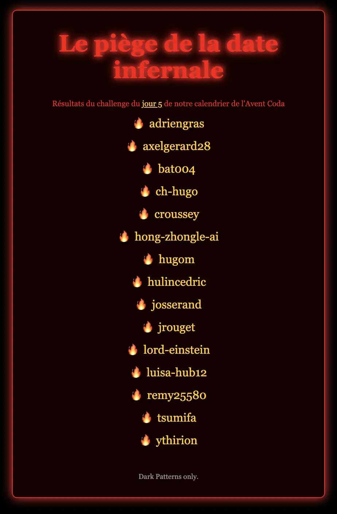

# Calendrier de l'Avent Coda - 2025

**24 jours de code, de défis et de fun** pour booster tes skills avant Noël ! 🎅

Une initiative [Coda](https://www.coda.school/), pour *s’inspirer, apprendre et grandir ensemble*.

## Challenges

| Jour | Titre                                                                                     | Thème                     | Description                                                                                           | Langages                                       |
|------|-------------------------------------------------------------------------------------------|---------------------------|-------------------------------------------------------------------------------------------------------|------------------------------------------------|
| 01   | [Un curieux message](https://coda-school.github.io/advent-2025/?day=01)                   | Cyber                     | Décrypter un message du père Noël                                                                     | `any`                                          |
| 02   | [Compter les Rennes](https://coda-school.github.io/advent-2025/?day=02)                   | Algo                      | Algo pour automatiser le comptage des Rennes                                                          | 🅲️ `C`                                        |
| 03   | [Le script fantôme](https://coda-school.github.io/advent-2025/?day=03)                    | Systèmes                  | Gestion des droits d'exécution du `script` de backup de la liste des enfants                          | 🐚 `shell`                                     |
| 04   | [Bataille de biscuits](https://coda-school.github.io/advent-2025/?day=04)                 | Algo                      | Identifier les elfes les plus gourmands                                                               | `any`                                          |
| 05   | [Le piège de la date infernale](https://coda-school.github.io/advent-2025/?day=05)        | UX / UI                   | Implémeter des `Dark Patterns` pour rendre inutilisable 1 `DatePicker`                                | 📊 `html, css, js`                             |
| 06   | [Une histoire de poids](https://coda-school.github.io/advent-2025/?day=06)                | Craft                     | Ajouter des `tests unitaires` sur le calcul de poids du traineau                                      | 🅲️ `C`, ☕️ `java`, 🏷️ `typescript`           |
| 07   | [L'imparfait du futur](https://coda-school.github.io/advent-2025/?day=07)                 | Craft                     | Utiliser un `linter` afin d'identifier des Code Smells et les corriger                                | 🍁 `C#`, ☕️ `java`, 🐘 `php`, 🏷️ `typescript` |
| 08   | [Les 3 enfants les plus sages](https://coda-school.github.io/advent-2025/?day=08)         | Data                      | Rechercher le top 3 des enfants sages ainsi que leurs localisations                                   | 🧭 `SQL`                                       |
| 09   | [Une distance en traîneau](https://coda-school.github.io/advent-2025/?day=09)             | Algo                      | Parser le tracé du père Noël, trier les résultats et calculer 1 distance                              | `any`                                          |
| 10   | [La quête du cadeau parfait](https://coda-school.github.io/advent-2025/?day=10)           | Design Pattern            | Changer l'algorithme de choix des cadeaux en utilisant le pattern `Strategy`                          | 🍁 `C#`, ☕️ `java`, 🐘 `php`, 🏷️ `typescript` |
| 11   | [Un bug bloque la tournée...](https://coda-school.github.io/advent-2025/?day=11)          | Bug Bounty  / refactoring | Identifier un bug dans les déplacements du père Noël et le corriger en appliquand la `règle du Scout` | 🍁 `C#`, ☕️ `java`, 🐘 `php`, 🏷️ `typescript` |
| 12   | [Elfe-ervescence](https://coda-school.github.io/advent-2025/?day=12)                      | Craft                     | Rendre 1 code plus `S.O.L.I.D`                                                                        | 🍁 `C#`, ☕️ `java`, 🐘 `php`, 🏷️ `typescript` |
| 13   | [La marketplace des Elfes](https://coda-school.github.io/advent-2025/?day=13)             | Numérique responsable     | Auditer la marketplace des elfes avec `Lighthouse` / `Eco-Index`                                      | 📊 `html, css, js`                             |
| 14   | [Le chemin des cadeaux](https://coda-school.github.io/advent-2025/?day=14)                | Algo                      | Calculer le nombre de maisons visitées par Santa en `n-1`                                             | `any`                                          |
| 15   | [Le code parfait de Nori](https://coda-school.github.io/advent-2025/?day=15)              | Pratique                  | Effectuer une revue de code elfique en mode `egoless programming`                                     | 🏷️ `typescript`                               |
| 16   | [Un message secret](https://coda-school.github.io/advent-2025/?day=16)                    | Cyber                     | `Déchiffrer` un email à l'aide de l'énigme de l'équipe ElfSec                                         | 🍁 `C#`, ☕️ `java`, 🐘 `php`, 🏷️ `typescript` |
| 17   | [if... elfe... refactor](https://coda-school.github.io/advent-2025/?day=17)               | Refactoring               | Appliquer les `Object Calisthenics` sur le calcul de la route à suivre en traineau                    | 🍁 `C#`, ☕️ `java`, 🐘 `php`, 🏷️ `typescript` |
| 18   | [Le mystère du GQS](https://coda-school.github.io/advent-2025/?day=18)                    | Algo                      | Convertir les entrées de GQS à décimal et calculer une moyenne                                        | `any`                                          |
| 19   | [Le vrai visage du Père Noël](https://coda-school.github.io/advent-2025/?day=19)          | Jeux vidéo                | Ajouter `Konami Code` sur la page de portfolio du père Noël pour voir son vrai visage                 | 📊 `html, css, js`                             |
| 20   | [Logistique Elfique](https://coda-school.github.io/advent-2025/?day=20)                   | Algo                      | Créer 1 commande `ls` elfique                                                                         | `any`                                          |
| 21   | [Démasquer l’elfe malveillant](https://coda-school.github.io/advent-2025/?day=21)         | Data                      | Démasquer l'elfe malveillant en analysant les `logs DB`                                               | 🧭 `SQL`                                       |
| 22   | [ASCII paraît, on installe le sapin ?](https://coda-school.github.io/advent-2025/?day=22) | Algo                      | Dessiner 1 sapin en `ASCII Art`                                                                       | `any`                                          |
| 23   | [Se rendre indispensable !!!](https://coda-school.github.io/advent-2025/?day=23)          | Refactoring               | Se rendre indispensable en rendant inmaintenable le code du module de gestion des stocks de jouets    | 🍁 `C#`, ☕️ `java`, 🐘 `php`, 🏷️ `typescript` |
| 24   | [Un Message du Père Noël](https://coda-school.github.io/advent-2025/?day=24)              | Introspection             | Remerciements, introspection, sondage                                                                 | N/A                                            |
| 25   | [L’Audit des cadeaux mécontents](https://coda-school.github.io/advent-2025/?day=25)       | Algo                      | Compter pour chaque pays le nombre d’enfants mécontents de leurs cadeaux                              | `any`                                          |

## Jour 5 - Le piège de la date infernale
Certains résultats pour ce challenge sont accessibles [ici](https://coda-school.github.io/datepickers-from-hell/).

